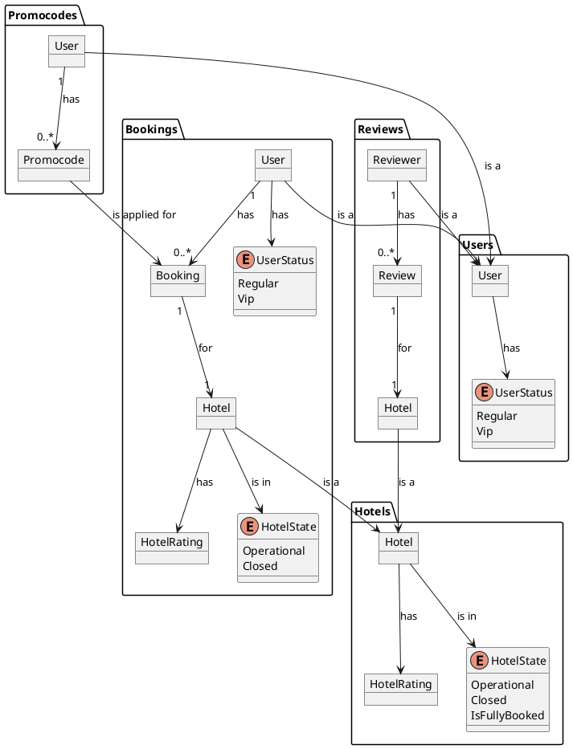

# ADR-001: <Краткое описательное название>

**Статус:** ⚠️ На рассмотрении  
**Участники:** <Имена и роли>  
**Дата:** <ГГГГ-ММ-ДД>  

---

## 1. Контекст

Сервис Hotelio реализован как единое приложение, в котором все бизнес-функции собраны в одном коде, разворачиваются как единый сервис и используют одну базу данных.
С ростом бизнеса возникли серьёзные архитектурные и операционные проблемы. Команда приняла решение о переходе на микросервисную архитектуру с постепенным выносом сервисов.

Текущая архитектура:

```plantuml
@startuml
!includeurl https://raw.githubusercontent.com/plantuml-stdlib/C4-PlantUML/master/C4_Component.puml

LAYOUT_WITH_LEGEND()

System_Boundary(hotelio, "Hotelio Monolith") {

  Container(monolith, "Monolith Application", "Spring Boot", "Legacy app exposing REST endpoints for hotel booking") {

    ' Controllers
    Component(bookingController, "BookingController", "Spring MVC", "/api/bookings")
    Component(hotelController, "HotelController", "Spring MVC", "/api/hotels")
    Component(promoController, "PromoCodeController", "Spring MVC", "/api/promos")
    Component(reviewController, "ReviewController", "Spring MVC", "/api/reviews")
    Component(userController, "UserController", "Spring MVC", "/api/users")

    ' Services
    Component(bookingService, "BookingService", "Java Service", "Validates and creates bookings")
    Component(hotelService, "HotelService", "Java Service", "Retrieves hotel details")
    Component(userService, "UserService", "Java Service", "Validates user status and blacklist")
    Component(promoService, "PromoCodeService", "Java Service", "Applies discounts and rules")
    Component(reviewService, "ReviewService", "Java Service", "Manages hotel reviews")

    ' DB
    ComponentDb(postgres, "Monolith DB", "PostgreSQL", "Stores users, hotels, bookings, reviews, promos")

    ' Controller-Service relations
    Rel(bookingController, bookingService, "Uses")
    Rel(hotelController, hotelService, "Uses")
    Rel(promoController, promoService, "Uses")
    Rel(reviewController, reviewService, "Uses")
    Rel(userController, userService, "Uses")

    ' Service-Service and Service-DB
    Rel(bookingService, hotelService, "Calls")
    Rel(bookingService, userService, "Calls")
    Rel(bookingService, promoService, "Calls")
    Rel(bookingService, reviewService, "Calls")

    Rel(bookingService, postgres, "Reads/Writes")
    Rel(userService, postgres, "Reads")
    Rel(hotelService, postgres, "Reads")
    Rel(promoService, postgres, "Reads")
    Rel(reviewService, postgres, "Reads/Writes")
  }
}

Person(user, "User", "Interacts with frontend")
Rel(user, bookingController, "Uses")
Rel(user, hotelController, "Uses")
Rel(user, promoController, "Uses")
Rel(user, reviewController, "Uses")
Rel(user, userController, "Uses")
@enduml
```

## 2. Требования

- Полный переход на микросервисную архитектуру.
- Service mesh с автоматизированными rollouts.
- Масштабируемая Kafka-инфраструктура.
- Метрики и трассировка на каждый сервис.
- GraphQL для фронтенда.

## 3. Решение

### Целевая архитектура

Используя DDD, по мере перехода к микросервисам, следует также пересмотреть границы модулей. В данный момент сервис Бронирования имеет очень много зависимостей от других модулей, что могло работать в рамках монолита, однако станет проблемой в микросервисной архитектуре.

Так как скидки требуется учитывать на этапе бронирования (т.к. оплата может быть не онлайн), следует внести информацию о статусе пользователя (вип-не вип) и соответствущую скидку в контекст бронирования (предполагается, что сущность Пользователь и так входит в контекст). Промокодам же действительно следует существовать как отдельному сервису из-за необходимости управлять ими.

Проверка активности и блокировки пользователя скорее должна осуществляться на этапе авторизации, и не должна производиться непосредственно в сервисе бронирования.

Кроме того, в контекст бронирований также должны входить и сущности отелей, но исключительно с информацией, необходимой для создания брони (работает ли отель и его рейтинг). Более того, именно сервис бронирования должен стать источником данных о свободных местах в отеле и наоборот распространять информацию о занятости в сервис Отелей, а не обращаться в него за этим.

Рейтинг же должен агрегироваться именно на основе данных из сервиса Отзывов и входить также в контекст бронирования и отелей.

Упрощенная модель взаимодействия и связей компонентов:



Таким образом чуть ли не единственным синхронным обращением к другому сервису в нашей модели станет проверка промокода, а все остальные взаимодействия будут носить характер подписка-публикация, где сервисы публикуют события в Kafka, а подписчики, получая эти события, обновляют необходимые данные уже внутри собственного контекста.

```plantuml
@startuml C2 Container Context
!include https://raw.githubusercontent.com/plantuml-stdlib/C4-PlantUML/master/C4_Container.puml

Boundary(bookingService, "Бронирование"){
    Container(booking, "Сервис бронирования", "ASP.NET.Core", "Бронирование отелей и управление бронью")
    ContainerDb(booking_db, "БД бронирования", "Postgres", "БД сервиса бронирования")
}

Boundary(usersService, "Пользователи"){
    Container(users, "Сервис пользователей", , "Управление пользователями")
    ContainerDb(users_db, "БД пользователей", "Postgres", "БД сервиса пользователей")
}

Boundary(hotelsService, "Отели"){
    Container(hotels, "Сервис отелей", , "Список отелей, добавление новых, управление существующими")
    ContainerDb(hotels_db, "БД отелей", "Postgres", "БД сервиса отелей")
}

Boundary(reviewsService, "Отзывы"){
    Container(reviews, "Сервис отзывов", , "Добавление отзывов, а также их модерация")
    ContainerDb(reviews_db, "БД отзывов", "Postgres", "БД отзывов")
}

Boundary(promocodesService, "Промокоды"){
    Container(promocodes, "Сервис промокодов", , "Добавление и проверка промокодов")
    ContainerDb(promocodes_db, "БД промокодов", "Postgres", "БД промокодов")
}

Container(bff, "BFF", "GraphQL")
   
ContainerQueue(messageBus, "Брокер сообщений", "Kafka")

Rel(booking, booking_db, "Чтение/запись", "SQL")
Rel(users, users_db, "Чтение/запись", "SQL")
Rel(hotels, hotels_db, "Чтение/запись", "SQL")
Rel(reviews, reviews_db, "Чтение/запись", "SQL")
Rel(promocodes, promocodes_db, "Чтение/запись", "SQL")

Rel(bff, bookingService, "Отправляет запросы")
Rel(bff, usersService, "Отправляет запросы")
Rel(bff, hotelsService, "Отправляет запросы")
Rel(bff, reviewsService, "Отправляет запросы")
Rel(bff, promocodesService, "Отправляет запросы")

Rel_U(bookingService, messageBus, "События бронирований", "Kafka Protocol")
Rel_D(messageBus, bookingService, "События оплаты, изменения пользователей, данных об отелях", "Kafka Protocol")

Rel_U(usersService, messageBus, "События добавления и изменения пользователей", "Kafka Protocol")

Rel_U(hotelsService, messageBus, "События добавления и изменения отелей", "Kafka Protocol")

Rel_U(reviewsService, messageBus, "События изменения рейтинга отелей", "Kafka Protocol")


Rel(booking, promocodes, "Проверка промокодов", "gRPC")

LAYOUT_TOP_DOWN()
@enduml 
```

Несмотря на то, что в текущей реализации платежная система не заявлена как отдельный сервис, вероятно, она предполагается. С точки зрения тех. анализа, следует ее вынести также в отдельный сервис и отделить от бронирования.

С точки зрения производительности, самыми критичными являются сервис бронирования и каталог отелей. Исходя из предыдущего анализа они и так выделены в отдельные сервисы.

### Порядок перехода


### Аргументация

| Критерий         | Обоснование                 |
|------------------|-----------------------------|
|                  |                             |

#### Последствия

**✅ Положительные:**
- 
- 

**⚠️ Негативные:**
- 
- 

**↗️ Зависимости:**
- 

---

### 4. Альтернативы

| Вариант      | Плюсы                      | Минусы                     | Почему отклонен           |
|--------------|----------------------------|----------------------------|---------------------------|
|              |                            |                            |                           |

---

### 5. Риски

1. **<Название риска>**  
   *Меры:* 

2. **<Название риска>**  
   *Меры:* 

3. **<Название риска>**  
   *Меры:* 